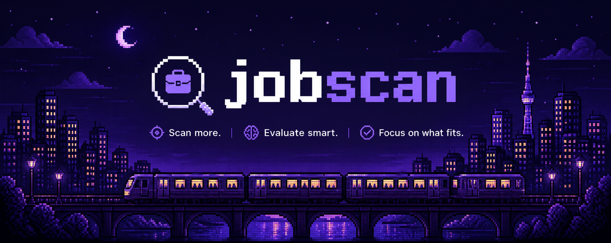
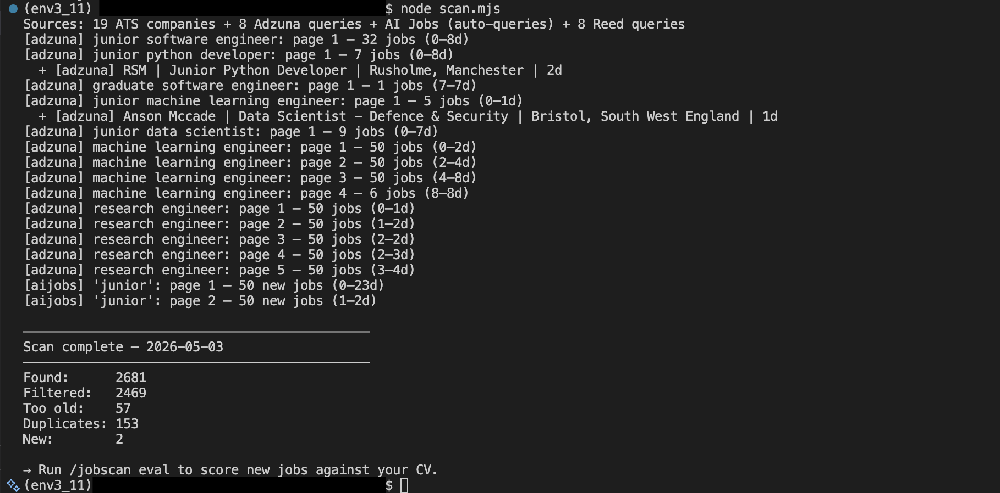

# jobscan



**Find more. Read less.** Wide job scanning + fast CV fit filtering.


---


```
Found: 2681         (total fetched from APIs this session)
Filtered: 2469      (removed by keyword/seniority/domain filters)
Too old: 57         (removed by time filter)
Duplicates: 153     (already fetched in previous sessions)
New: 2              (actually added to job inbox)
```
**2,681 fetched · 2 added to job inbox:**
That ratio is intentional. Aggressive pre-filtering by title, seniority, location, and domain keeps Claude's evaluation cost low — it only scores roles that are already plausible fits. Your numbers will vary by market and filter configuration.

---

jobscan is a job search pipeline built to reduce time spent scanning irrelevant roles.

It separates the process into two steps: first, scan broadly across multiple sources with aggressive filtering at the title, location, and seniority level; then evaluate each role once using Claude to answer a single question — *is this CV a plausible match?*
The goal is not deeper analysis, but faster triage: surface what’s worth reading, and ignore the rest.

Built for candidates casting a wide net, jobscan aggregates roles from multiple sources, filters early, and scores fit against your CV. It monitors a customised set of companies and pulls roles directly from their job boards.

This project is inspired by [career-ops](https://github.com/santifer/career-ops), but takes a different approach — prioritising broad scanning and minimal evaluation over detailed per-role analysis.
For me, 3 hours of manual browsing becomes ~20 minutes of focused review.

**Scope note:** Adzuna, aijobs.net, and ATS sources are multi-region. Reed API is UK-only.  
This project has not been validated across all markets — coverage and behaviour may vary by region.

## Sources

| Source | Type | Scanner | Coverage | Cost |
|--------|------|---------|----------|------|
| [Adzuna](https://developer.adzuna.com) | Job aggregator API | `node scan.mjs` | Global | Free (register) |
| [Reed UK](https://www.reed.co.uk/developers/Jobseeker) | REST API | `node scan.mjs` | UK only | Free (register) |
| [aijobs.net](https://aijobs.net) | HTML scraper | `node scan.mjs` | Global AI/ML roles | Free |
| Tracked companies (custom ATS) | Claude WebSearch | `/scan` | Global (best-effort) | Token-based |


## Quick Start
```bash
# 0. Clone and install
git clone https://github.com/chimera878/jobscan.git
cd jobscan

# 1. Install dependencies
npm install && pip install pyyaml

# 2. Configure portals.yml
cp portals.example.yml portals.yml  # add your Adzuna + Reed API keys here
# - adzuna_app_id / adzuna_app_key  from https://developer.adzuna.com
# - reed_api_key (UK only)          from https://www.reed.co.uk/developers/Jobseeker

# 3. Prepare your CV  
pandoc cv.docx -o cv.md             # from Word
pandoc cv.pdf  -o cv.md             # from PDF

# 4. Run setup — open Claude Code in this directory, then:
claude                              # open Claude Code in this directory
/init                               # first-time setup, or re-run to reconfigure
# NOTE: /init, /scan and /eval must be run inside Claude Code
# writes search queries into portals.yml and resolves companies to job board URLs

# 5. Scan for jobs
node scan.mjs                       # zero-token scan: APIs and ATS
/scan                               # optional: company-specific scan via Claude WebSearch (uses tokens)
# max_age_days defaults to 5 in portals.yml (fetch jobs posted in last 5 days)

# 6. Evaluate listings
/eval                              # scores each pending job (score 0-5) against your CV
# above threshold → Active | below → Done | unresolvable → Unresolvable
# score_threshold defaults to 3.5 in portals.yml
```
Run at least one scan (`node scan.mjs` or `/scan`) before `/eval`.
## File structure

```
.
├── scan.mjs              # main scanner (Node.js)
├── adzuna_scan.py        # Adzuna API client (Python)
├── aijobs_scan.py        # aijobs.net HTML scraper (Python)
├── portals.example.yml   # config template → copy to portals.yml
├── package.json
│
│   # created on first run, gitignored:
├── portals.yml           # your search config (API keys, filters, queries, company watchlist)
├── cv.md                 # your CV — source of truth for scoring
├── pipeline.md           # job inbox (Active / Unresolvable / Done)
└── scan-history.tsv      # dedup log (append-only)
```

## Configuration reference

All fields live in `portals.yml`.

| Field | Purpose |
|-------|---------|
| `adzuna.app_id` / `app_key` | Adzuna API credentials |
| `reed_api_key` | Reed UK API key |
| `max_age_days` | Ignore jobs older than N days |
| `score_threshold` | Auto-archive jobs scoring below this (0–5 scale) |
| `location_filter` | Allow/block job locations |
| `seniority_filter` | Exclude wrong seniority titles at scan time |
| `keyword_filter` | Require at least one keyword in job title |
| `domain_filter` | Exclude role types (frontend, embedded, etc.) |
| `tech_stack` | Skills Claude uses when scoring fit |
| `adzuna_queries` | Search terms sent to Adzuna |
| `reed_queries` | Search terms sent to Reed |
| `tracked_companies` | Companies to monitor|